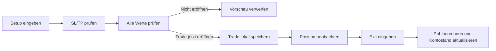

# Northstar Journal

Ein ruhiges, lokales Trading-Tagebuch für strukturierte Entscheidungen vor, während und nach einem Trade.

Northstar Journal verbindet einen Pre-Trade-Rechner mit einer einfachen Positionsübersicht, Tagesanalyse und Trade-Historie. Die Anwendung hilft dabei, Risiko nicht nur zu schätzen, sondern vor dem Einstieg sichtbar und nachvollziehbar zu machen.

> **Hinweis:** Dieses Projekt ist ein Planungs- und Dokumentationswerkzeug. Es gibt keine Anlageberatung und platziert keine Orders bei einem Broker oder bei MetaTrader 5.

## Warum dieses Projekt?

Trading-Entscheidungen werden oft unter Zeitdruck getroffen. Dabei gehen wichtige Fragen leicht unter:

- Wo liegen Stop-Loss und Take-Profit?
- Wie groß darf die Position bei einem festen Risiko sein?
- Wie viel Margin wird gebunden?
- Wie viel freie Margin bleibt übrig?
- Wurde der Trade nach dem Plan eröffnet?
- Was ist heute bereits passiert?

Northstar Journal beantwortet diese Fragen in einem klaren Ablauf. Erst werden die geplanten Werte geprüft. Erst danach wird der Trade ausdrücklich eröffnet und gespeichert.

## Funktionen

### Pre-Trade-Rechner

Der Rechner verwendet Entry, Richtung, Risiko, R:R, Stop-Distanz, Kontostand und Hebel aus der Konfiguration. Er zeigt:

- Stop-Loss
- Take-Profit
- Risiko in EUR
- MT5-Volumen in Lots
- Positionswert
- Hebel
- gebundene Margin
- freie Margin
- Margin Level

Die Ergebnisse erscheinen zunächst als Vorschau. Mit **Trade jetzt eroeffnen** wird die Position gespeichert. Mit **Nicht eroeffnen / Zurueck** wird die Vorschau verworfen, ohne einen Trade anzulegen.

### Offene Positionen

Offene Trades werden separat angezeigt. Beim Schließen wird der PnL aus Entry, Exit, Richtung und Positionsgröße berechnet. Erst dann wird der Kontostand angepasst.

### Tagesanalyse

Die Today-Ansicht zeigt unter anderem:

- Anzahl geschlossener Trades
- Win-Rate
- Tages-PnL
- durchschnittliches R-Multiple
- Equity-Kurve
- Nutzung des Daily-Loss-Limits
- Strategie-Compliance

### Historie

Geschlossene Trades können nach Instrument, Ergebnis und PnL durchsucht und nach WIN, LOSS oder BE gefiltert werden.

### Prop-Firm-Übersicht

Die App visualisiert Daily Loss, Max Drawdown und Profit Target. So bleibt sichtbar, wie viel des jeweiligen Rahmens bereits genutzt wurde.

### JSON-Konfiguration

Trading-Parameter können als JSON geladen und exportiert werden. Beispiel-Dateien liegen in [`configs/`](configs/):

- [`example-config.json`](configs/example-config.json)
- [`ftmo-demo.json`](configs/ftmo-demo.json)
- [`ftmo-demo-final.json`](configs/ftmo-demo-final.json)

## Ablauf eines Trades



## Berechnungen

### Risiko

Das Risiko wird aus dem aktuellen Kontostand und dem Risiko-Prozentsatz berechnet:

```text
Risiko = Kontostand × Risiko-Prozent / 100
```

### Stop-Loss und Take-Profit

Für einen Long-Trade:

```text
Stop-Loss   = Entry - Stop-Distanz
Take-Profit = Entry + Stop-Distanz × R:R
```

Für einen Short-Trade werden die Vorzeichen umgekehrt.

### Positionsgröße

Die Positionsgröße wird anhand des geplanten Risikos berechnet und auf den MT5-Volumenschritt von 0,01 Lots abgerundet. Zusätzlich begrenzt der konfigurierte Hebel die maximale Positionsgröße.

```text
Risiko-basierte Lots = (Risiko × Entry) / (Stop-Distanz × Kontraktgröße)
Maximale Lots        = (Kontostand × Hebel) / Kontraktgröße
```

Die Anwendung verwendet aktuell eine Kontraktgröße von 100.000 Einheiten.

### Margin

```text
Gebundene Margin = Positionswert / Hebel
Freie Margin     = Kontostand - gebundene Margin
Margin Level     = Kontostand / gebundene Margin × 100
```

Bei keiner offenen Position wird das Margin Level als `∞ %` angezeigt. Die Berechnung ist eine vereinfachte Journal-Berechnung und ersetzt nicht die Margin-Anzeige des Brokers.

## Starten

Es werden keine Pakete und kein Build-Schritt benötigt.

1. Repository herunterladen oder klonen.
2. [`index.html`](index.html) im Browser öffnen.
3. Unter **Settings** die Kontodaten und Risikowerte prüfen.
4. Eine JSON-Datei aus [`configs/`](configs/) laden oder eigene Werte eintragen.
5. Unter **New Trade** einen Trade planen.

Optional kann das Projekt mit einem beliebigen lokalen Static-File-Server geöffnet werden, zum Beispiel:

```bash
python3 -m http.server 8000
```

Danach ist die App unter <http://localhost:8000> erreichbar.

## Daten und Datenschutz

Die Anwendung arbeitet local-first:

- Trades und Einstellungen werden im Browser in `localStorage` gespeichert.
- Es gibt keinen Server und keine automatische Cloud-Synchronisierung.
- JSON-Konfigurationen können manuell importiert und exportiert werden.
- Browserdaten müssen vor dem Löschen des Browserprofils gesichert werden.

Der lokale Speicher-Key der Anwendung lautet `northstar-journal-v1`.

## Projektstruktur

```text
.
├── index.html              # Hauptansicht der Anwendung
├── css/
│   ├── style.css           # Layout und Komponenten
│   └── variables.css       # Farben, Schriften und Designvariablen
├── js/
│   └── app.js              # State, Berechnungen und Interaktionen
├── pages/                  # Einzelne Seiten-/Ansichtsfragmente
└── configs/                # Beispiel- und Demo-Konfigurationen
```

## Technischer Rahmen

- HTML5
- CSS3
- Vanilla JavaScript
- Browser `localStorage`
- File System Access API, sofern vom Browser unterstützt
- Canvas für die Equity-Kurve

## Bekannte Grenzen

- Es werden keine echten Orders ausgeführt.
- Kurse werden nicht live von einem Broker abgerufen.
- Die Margin-Berechnung berücksichtigt keine Swaps, Kommissionen, Floating PnL oder broker-spezifischen Regeln.
- Die aktuelle Logik ist auf die verwendete Kontraktgröße und den MT5-Volumenschritt ausgelegt.
- Die Daten liegen nur im jeweiligen Browserprofil.

## Ziel

Northstar Journal soll aus einem spontanen Trade eine dokumentierte Entscheidung machen: Setup prüfen, Risiko verstehen, bewusst eröffnen und anschließend ehrlich auswerten.

## Lizenz

Für dieses Repository ist aktuell keine Lizenzdatei hinterlegt. Vor einer öffentlichen Weiterverwendung sollte eine passende Open-Source-Lizenz ergänzt werden.
